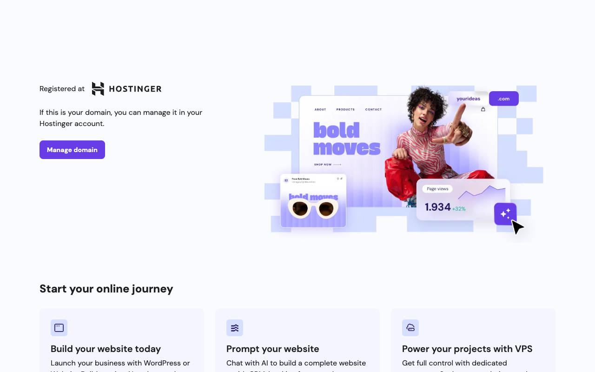

<p align="center">
  <b>🚀 ONILABS · Portfolio</b><br>
  <sub>Portfolio del equipo ONILABS — servicios, proyectos, proceso y contacto, con formulario que envía correo.</sub>
</p>

<p align="center">
  
</p>

<p align="center">
  
  
  
  
</p>

---

## Qué hace

Sitio portfolio del equipo **ONILABS**. Presenta los servicios, el proceso de trabajo, el equipo y los proyectos destacados, y permite que un cliente se ponga en contacto mediante un **formulario que envía correo** por detrás (API route con Nodemailer).

## Funcionalidades

- Páginas: `Inicio` y `Proyectos`.
- Secciones: Hero, Servicios, Proyectos destacados, Proceso, Equipo y Contacto.
- Modal promocional.
- Formulario de contacto que envía correo vía **Nodemailer** (serverless).
- Datos de proyectos centralizados en `src/data/onilabs.js`.

## Uso local

```bash
npm install
npm run dev      # http://localhost:3000
```

> El formulario de contacto necesita variables de entorno para Nodemailer:
>
> | Variable | Uso |
> |----------|-----|
> | `EMAIL_USER` | Cuenta que envía el correo |
> | `EMAIL_PASS` | Contraseña / app password |
> | `NEXT_PUBLIC_SITE_URL` | URL pública del sitio |

## Tecnologías

| Capa | Stack |
|------|-------|
| Framework | Next.js 13 (Pages Router) |
| UI | React 18 |
| Estilos | Tailwind CSS |
| Email | Nodemailer |

---

<p align="center"><sub>Hecho con ❤️ por <a href="https://github.com/anthoniriv">ONILABS</a></sub></p>
